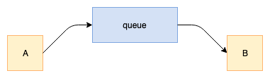
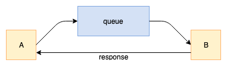
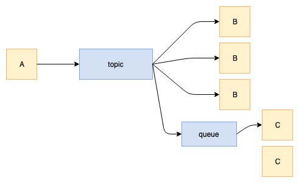
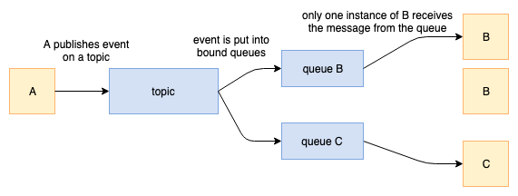

# Messaging Layer Properties

## Communication Patterns

Messaging Layer provides an intersevice communucation layer based on abstracted
message bus, implementing the range of communication patterns:

* Command
* Query
* Event

### Command

* one-to-one, send and forget

*Command* is a communication pattern where application A (producer) asynchronously
sends a message to a queue, from which application B (consumer) receives the message.

In this case the application A sends the message and continues the execution immediately
after the message has been accepted by the Messaging Layer.

There can be multiple instances of application B running and processing messages from
the same queue. The Messaging Layer guarantees that only one instance of application B
will receive this message.

### Query

* one-to-one, request/response

*Query* is a communication pattern where application A sends a message (request) to
a queue, from which application B receives the message, and waits for another
message (response) from B.

In this case application A sends the message and stops execution until
the response from application B is received or the timeout is fired.

This communication pattern is synchronous, and there are several things that
may go wrong during this communication: the target queue name is wrong,
the application B may be down, or the application B just could not produce a response
in time and the timeout is fired.

There can be multiple instances of application B running and processing messages from
the same queue. The Messaging Layer guarantees that only one instance of application B
will receive this message, and the response message will be delivered to the same
instance of application A, that produced the request.

### Event

* one-to-many, pub/sub

*Event* is a communication pattern where application A sends a message (event) to
a topic, to which many other applications may subscribe and listen for events.
There can be  multiple instances of the same application B subscribed to this topic,
or it may be different applications B and C subscribed to the same topic.

In this case the application A sends the message and continues the execution immediately
after the message has been accepted by the Messaging Layer. The Messaging Layer
delivers the message to the topic and all the subscribed listeners, if there are any.

#### Listening for events

While producing an event is simple and it only means posting a message to a topic,
listening for events has two variants:

* Listening for events on a topic directly

An application can listen for events on a topic directly. That means that
whenever the event is published on a topic, every application instance listening for the
events directly will receive this event. If the application listening for the
events in such a way is down, it is not guaranteed that the events published while it
was offline will be delivered after it gets back online.

* Listening for events on a topic using a queue

An application can listen for events on a topic using a bound queue. That means
that every event published on the given topic will be additionally put into specified
queue, from which the message is consumed by only one instance of the application.
In this case the queue will keep the messages (events) even while the listening
applications/instances are down, and the messages will be delivered once the
application gets back online.

## Logical names for message targets

Whenever a message (command, query or event) is sent, Messaging Layer expects
a "target" for the message to be specified. This target is a logical name
that defines the destination of a message.

For commands and queries, the target of the message consists of a queue name
and a method name (e.g. `"customers/create"`).

For events, the target of the message consists of a topic name and an
event type (e.g. `"customers/created"`).

This allows to model the communication around your business domain concepts,
and not the implementation details like application or host names.

## Delivery guarantee

Messaging Layer guarantees "at-least-once" message delivery.

Once the call to `command()`, `query()`, `event()` successfully completes,
it is guaranteed that the Messaging Layer accepted the message,
and the message will eventually be delivered to the recipient.

"at-least-once" means that in certain cases the same message may be delivered
more than once, and the applications consuming the messages must be prepared to
deal with it, which in most cases means implementing idempotent message processors.

### Notes:

>  `query()` method successfully returns only after the response has been received,
at which point the caller may be sure that not only the message has been accepted
by the Messaging Layer, but that it has been delivered and successfully processed
by the recepient.

> `event()` method successfully completing guarantees only that the message
will be delivered to the topic -- the message may still be lost by the listener if
it does not use a queue for keeping the messages

## Load balancing

The Messaging Layer ensures best-effort load balancing of messages in case there
are multiple message processors for the same request target (for Command and Query
processors), or multiple listeners (for Event processors with a queue).

## Ordering of messages

The Messaging Layer does NOT guarantee that the messages will be delivered
in the same order as they were produced.

--
